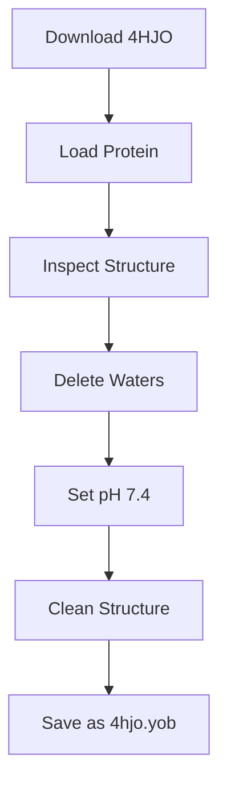

# Chapter 2
# Protein Preparation

> **Estimated Reading Time:** 30–40 minutes
>
> **Difficulty:** ⭐⭐ Beginner – Intermediate

---

# Overview

Protein preparation is one of the most critical steps in any molecular docking study. Even the most advanced docking algorithm cannot produce reliable results if the protein structure is not properly prepared.

Experimental protein structures obtained from the Protein Data Bank (PDB) often contain components that are unnecessary or even detrimental for docking simulations, such as crystallographic water molecules, buffer ions, or alternate atom conformations. Preparing the receptor ensures that the docking experiment represents a biologically relevant system.

In this chapter, you will learn how to prepare the EGFR protein (PDB ID: **4HJO**) using **YASARA Structure**.

---

# Learning Objectives

After completing this chapter, you will be able to:

- Understand the contents of a PDB file.
- Load protein structures into YASARA.
- Remove unnecessary molecules.
- Adjust the physiological pH.
- Clean and optimize the protein structure.
- Save the prepared receptor for subsequent docking studies.

---

# Why Protein Preparation Matters

Protein preparation improves the quality of docking simulations by:

- Removing unwanted crystallographic water molecules.
- Correcting missing hydrogen atoms.
- Optimizing protonation states.
- Fixing structural inconsistencies.
- Producing a receptor suitable for computational analysis.

Skipping these steps can lead to:

- Incorrect docking poses.
- Unrealistic hydrogen bonding.
- Poor binding energy predictions.
- Reduced reproducibility.

---

# Workflow

```text
Download Protein

↓

Load Protein

↓

Inspect Structure

↓

Delete Waters

↓

Set pH

↓

Clean Structure

↓

Save as YASARA Object
```

---

# Step 1 — Download the Protein Structure

The receptor used in this tutorial is:

| Property | Value |
|----------|-------|
| Protein | EGFR Tyrosine Kinase |
| PDB ID | **4HJO** |
| Format | PDB |

Download the structure from the RCSB Protein Data Bank and save it as:

```text
4hjo.pdb
```

---

# Step 2 — Load the Protein

Open **YASARA Structure**.

Navigate to:

```text
File

↓

Load

↓

PDB File
```

Select:

```text
4hjo.pdb
```

The protein structure will appear in the 3D viewer.

> **Tip:** Rotate and inspect the structure before making any modifications.

---

# Step 3 — Inspect the Protein

Before editing, examine the contents of the structure.

Typical components include:

- Protein chains
- Native ligand
- Water molecules
- Ions
- Cofactors

Understanding these components helps determine which molecules should be retained or removed during preparation.

---

# Step 4 — Remove Water Molecules

Crystallographic water molecules are commonly present in X-ray structures. While some waters are biologically important, most are artifacts of crystallization and are removed before docking.

In YASARA:

```text
Edit

↓

Delete

↓

Waters
```

After deletion, verify that only the protein and essential molecules remain.

> **Note:** Retaining unnecessary water molecules may interfere with ligand binding and affect docking accuracy.

---

# Step 5 — Set Physiological pH

Protein protonation depends on environmental pH.

For this tutorial, set the pH to:

```text
7.4
```

Navigate to:

```text
Options

↓

Default pH

↓

7.4
```

This step assigns appropriate protonation states to ionizable residues, improving the biological realism of the receptor.

---

# Step 6 — Clean the Structure

Cleaning the structure ensures that atom names, bonding information, and geometry are internally consistent.

Navigate to:

```text
Edit

↓

Clean

↓

All
```

YASARA will automatically:

- Add missing hydrogen atoms.
- Correct bond orders.
- Resolve minor structural issues.

> **Tip:** Always clean the structure before any docking experiment.

---

# Step 7 — Save the Prepared Protein

Save the prepared receptor as a YASARA Object.

Navigate to:

```text
File

↓

Save As

↓

YASARA Object
```

Save the file as:

```text
4hjo.yob
```

This format preserves all preparation settings and can be reopened without repeating the preparation process.

---

# Protein Preparation Workflow



---

# Best Practices

- Always keep the original `.pdb` file unchanged.
- Save intermediate files after major modifications.
- Document every preparation step.
- Use descriptive filenames.
- Organize files into dedicated project folders.

---

# Common Mistakes

| Mistake | Consequence |
|----------|-------------|
| Forgetting to delete water | Incorrect docking interactions |
| Skipping pH adjustment | Wrong protonation states |
| Not cleaning the structure | Geometry errors |
| Overwriting the original PDB | Loss of raw experimental data |

---

# Troubleshooting

## Water molecules are still visible

Repeat:

```text
Edit → Delete → Waters
```

---

## Protein appears incomplete

Check whether the downloaded PDB file is complete and corresponds to the intended biological assembly.

---

## YASARA reports structural errors

Run:

```text
Edit → Clean → All
```

again and verify the console for warnings.

---

# Expected Output

After completing this chapter, your project should contain:

```text
protein/

├── 4hjo.pdb
└── 4hjo.yob
```

The file `4hjo.yob` will serve as the starting point for receptor preparation and docking validation.

---

# Summary

Protein preparation is the foundation of reliable molecular docking. Proper cleaning, protonation, and optimization ensure that the receptor accurately represents the biological target and minimizes artifacts during docking simulations.

In this chapter, you learned how to:

- Load a protein into YASARA.
- Remove crystallographic water molecules.
- Set physiological pH.
- Clean the protein structure.
- Save the prepared receptor.

These steps establish a reproducible workflow that will be used throughout the remainder of this tutorial.

---

# Next Chapter

➡ **Chapter 3 – Docking Validation**

In the next chapter, you will learn how to validate the docking protocol by performing **100 redocking simulations**, calculating RMSD values, and determining whether the protocol is suitable for predicting ligand binding.
