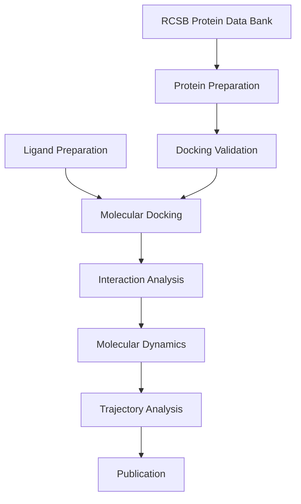

# YASARA Molecular Docking & Molecular Dynamics Tutorial

<p align="center">


# Molecular Docking and Molecular Dynamics Simulation Using YASARA Structure

**Comprehensive Tutorial for Beginners and Researchers**


</p>

---

# Overview

Welcome to the **YASARA Molecular Docking & Molecular Dynamics Tutorial** repository.

This repository provides a complete, step-by-step guide for performing computational drug discovery using **YASARA Structure**.

The tutorial is specifically designed for:

- Undergraduate students
- Graduate students
- Academic researchers
- Pharmaceutical scientists
- Computational chemists
- Structural biologists
- Bioinformaticians

Unlike conventional manuals that only explain software operations, this tutorial also explains **why** each step is necessary from a scientific perspective.

---

# What You Will Learn

By completing this tutorial, you will learn how to:

✅ Download protein structures from RCSB Protein Data Bank

✅ Prepare protein structures for docking

✅ Prepare ligand molecules

✅ Validate docking protocols using redocking

✅ Calculate RMSD values

✅ Perform Molecular Docking

✅ Analyze docking results

✅ Visualize protein-ligand interactions

✅ Run Molecular Dynamics Simulation

✅ Analyze MD trajectories

✅ Interpret RMSD, RMSF, Radius of Gyration, SASA, Hydrogen Bond, and Energy plots

---

# Learning Objectives

After completing this tutorial, participants are expected to be able to:

- Understand the basic principles of molecular docking.
- Explain the purpose of docking validation.
- Prepare proteins and ligands correctly.
- Perform docking using YASARA.
- Evaluate docking quality using RMSD.
- Interpret binding energy values.
- Perform Molecular Dynamics simulations.
- Evaluate structural stability through trajectory analysis.
- Produce publication-quality computational research.

---

# Computational Workflow

```text
Protein Retrieval
        │
        ▼
Protein Preparation
        │
        ▼
Ligand Preparation
        │
        ▼
Docking Validation
        │
        ▼
Redocking (100x)
        │
        ▼
RMSD Evaluation
        │
        ▼
Molecular Docking
        │
        ▼
Best Pose Selection
        │
        ▼
Interaction Analysis
        │
        ▼
Molecular Dynamics
        │
        ▼
Trajectory Analysis
        │
        ▼
Final Interpretation
```

---

# Workflow Diagram



---

# Repository Structure

```
yasara-tutorial/

│

├── README.md

├── LICENSE

├── CHANGELOG.md

├── CONTRIBUTING.md

├── CITATION.cff

│

├── docs/

│ ├── 01-installation.md

│ ├── 02-introduction-to-yasara.md

│ ├── 03-download-protein.md

│ ├── 04-protein-preparation.md

│ ├── 05-validation-redocking.md

│ ├── 06-rmsd-analysis.md

│ ├── 07-native-ligand-docking.md

│ ├── 08-binding-pocket.md

│ ├── 09-receptor-preparation.md

│ ├── 10-ligand-preparation.md

│ ├── 11-running-macro.md

│ ├── 12-analyzing-log.md

│ ├── 13-discovery-studio.md

│ ├── 14-quercetin-docking.md

│ ├── 15-md-preparation.md

│ ├── 16-running-md.md

│ ├── 17-md-analysis.md

│ ├── 18-troubleshooting.md

│ └── 19-faq-and-references.md

│

├── examples/

├── images/

├── macros/

├── datasets/

└── references/
```

---

# Required Software

| Software | Function |
|------------|---------------------------|
| YASARA Structure | Molecular Modeling |
| Discovery Studio Visualizer | Interaction Analysis |
| PubChem | Ligand Database |
| RCSB Protein Data Bank | Protein Database |
| PyMOL *(Optional)* | Molecular Visualization |

---

# Hardware Recommendation

Minimum Specification

| Component | Requirement |
|------------|----------------|
| CPU | Intel Core i5 |
| RAM | 8 GB |
| Storage | 10 GB |
| GPU | Not Required |

Recommended Specification

| Component | Requirement |
|------------|----------------|
| CPU | Intel Core i7 / Ryzen 7 |
| RAM | 16–32 GB |
| Storage | SSD |
| GPU | Optional |

---

# Folder Description

## docs/

Contains all tutorial chapters.

---

## macros/

Contains YASARA macro scripts.

Example:

```
dock_run.mcr

md_runmembrane.mcr

md_analyze.mcr
```

---

## examples/

Contains sample datasets.

Example:

```
4hjo.pdb

quercetin.sdf

4hjo_receptor.sce
```

---

## images/

Contains tutorial screenshots.

Example

```
load_pdb.png

energy_minimization.png

binding_pocket.png

md_results.png
```

---

# Dataset Used

Protein

```
PDB ID : 4HJO
```

Ligand

```
Native Ligand

Quercetin
```

---

# Expected Output

After completing this tutorial, you should obtain:

✔ Docking Log

✔ RMSD File

✔ Docking Pose

✔ Binding Energy

✔ Hydrogen Bond Analysis

✔ MD Trajectory

✔ RMSF Plot

✔ RMSD Plot

✔ Radius of Gyration Plot

✔ SASA Plot

✔ Simulation Report

---

# Scientific Background

Modern drug discovery increasingly relies on computational methods to reduce the time and cost associated with experimental screening. Among the most widely used techniques are **Molecular Docking** and **Molecular Dynamics (MD) Simulation**.

Molecular Docking predicts the preferred binding orientation of a ligand within the active site of a target protein, providing estimates of binding affinity and interaction patterns. However, docking results represent static snapshots and do not account for the dynamic behavior of biomolecular systems.

To address this limitation, Molecular Dynamics Simulation is employed to evaluate the stability of protein–ligand complexes under near-physiological conditions. MD simulations enable researchers to investigate structural fluctuations, conformational changes, hydrogen bond persistence, solvent interactions, and overall complex stability over time.

By integrating docking with molecular dynamics, researchers can obtain more reliable insights into ligand binding mechanisms and improve the confidence of computational predictions before experimental validation.

---

# Citation

If you use this tutorial in your research or teaching activities, please cite:

```
YASARA Molecular Docking and Molecular Dynamics Tutorial

Version 1.0

2026
```

---

# License

This project is distributed under the MIT License.

---

# Acknowledgements

Special thanks to

- YASARA Development Team
- RCSB Protein Data Bank
- PubChem
- Discovery Studio Visualizer
- Scientific Community

---

# Next Chapter

➡ **Part 2**

```
docs/01-installation.md
```

This chapter explains:

- Installing YASARA Structure
- Installing Discovery Studio Visualizer
- Downloading the required datasets
- Folder organization
- Software verification
- Common installation issues
